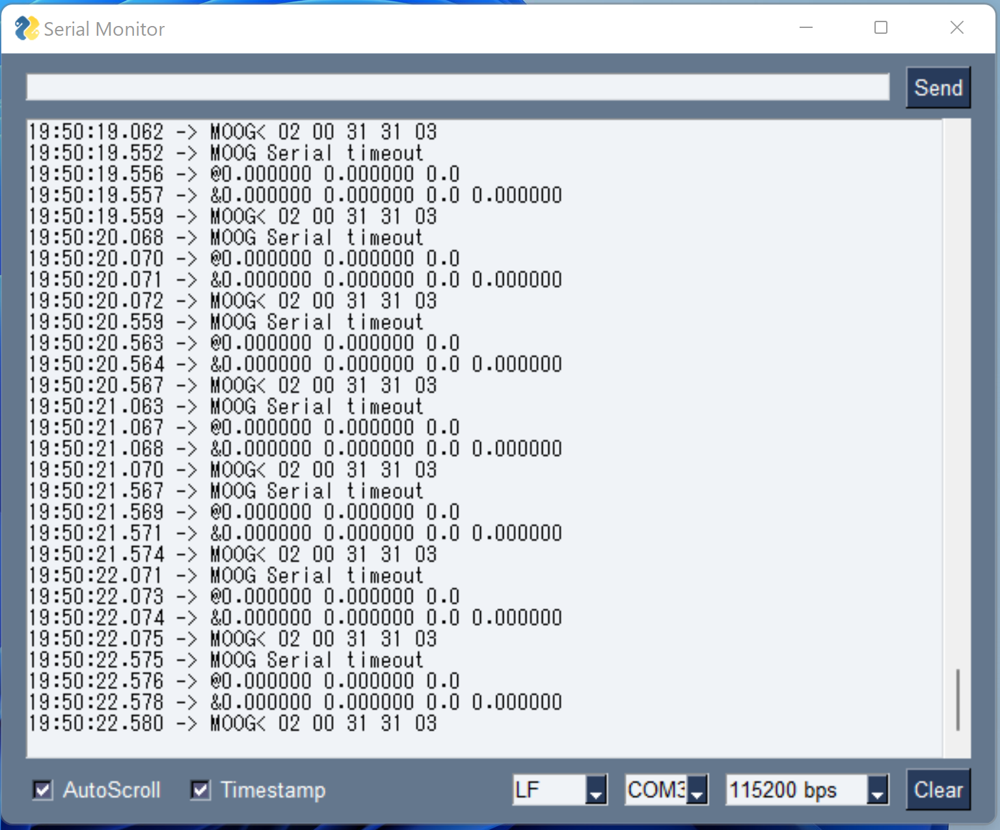

# SerialMonitor
PySimpleGUIを使ったシリアルモニター

PySimpleGUI、pySerial、pyinstallerの学習のために作成しました。

機能は、ArduinoIDEのシリアルモニターとほとんど同じです。

Windowsのみで動作確認しています。



## Pythonでの実行
```
>python SerialMonitor.py
```

## EXE化
pyinstallerでexe化して、python環境がないWindowsでも動作するようにします。

### 仮想環境作成
余分なライブラリなどがインストールされていると、exeのサイズが大きくなるので、venvで仮想環境を作成します。
```
> venv.bat
```

### ビルド
仮想環境が立ち上がったら、以下のバッチファイルでexeを作成します。
```
(venv)> build.bat
```

### exeファイル
distフォルダの中に、exeファイルが作成されます。


